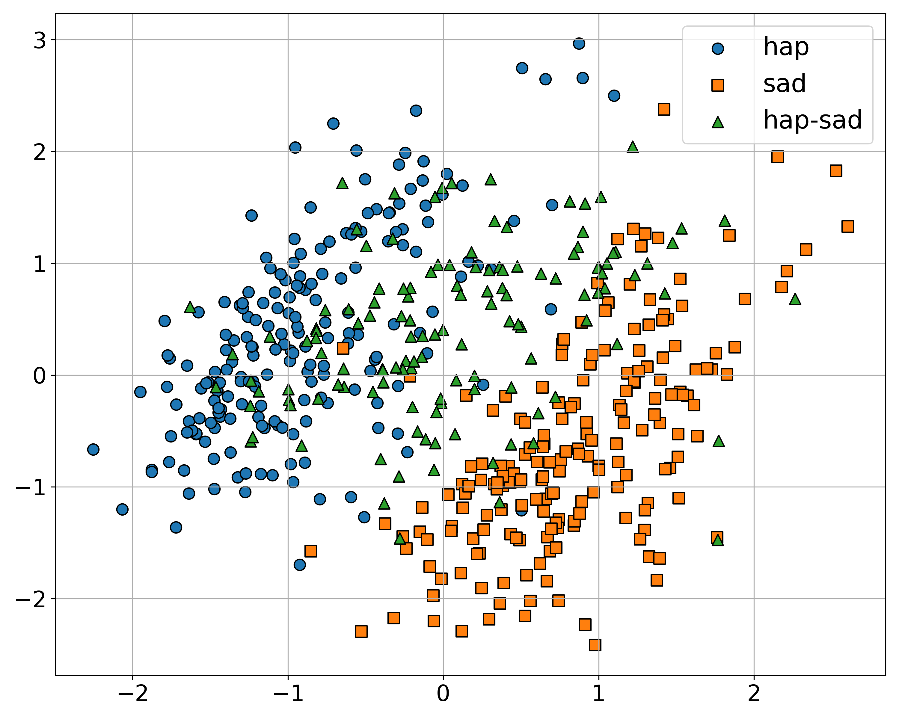
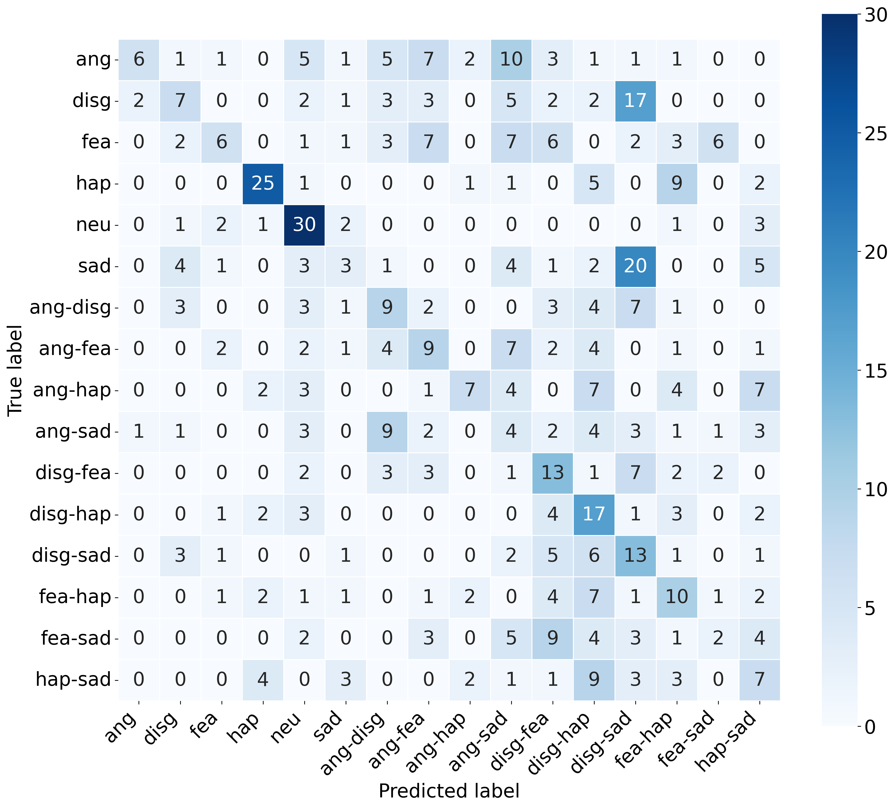

# BlEmoRe-common

This repository contains the code, baseline models, and results for the Blended Emotion Recognition Challenge (BlEmoRe). 
The challenge introduces a novel multimodal [dataset](https://zenodo.org/records/15096942) of blended emotion portrayals 
with fine-grained salience labels and promotes the development of methods capable of recognizing blended emotions from video and audio signals.

## Baselines

We provide simple baselines using features from pre-trained models:

* Frame-based encoders: OpenFace 2.0, CLIP, ImageBind
* Spatiotemporal encoders: VideoMAEv2, Video Swin Transformer

Features are either:

* Aggregated (mean, std, percentiles) into a single video-level vector, or
* Subsampled from short video clips (16 frames) without aggregation.

Lightweight feedforward models (Linear, MLP with 256 or 512 hidden units) are trained to predict emotion presence and salience.

These baselines serve as a reference for the challenge.

### Feature Visualizations

<div align="center">
  <table>
    <tr>
      <td>
        
        <p><b>Figure 2:</b> PCA projection of ImageBind features (Happy vs Sad).</p>
      </td>
      <td>
        
        <p><b>Figure 3:</b> PCA projection of VideoMAEv2 features (Happy vs Sad).</p>
      </td>
    </tr>
  </table>
</div>

### Validation Results (Best Models Only)

| Encoder              | Method        | Model      | Presence Accuracy (mean ± std) | Salience Accuracy (mean ± std) |
|----------------------|---------------|------------|--------------------------------|--------------------------------|
| clip                  | Aggregation   | MLP-512    | 0.266 ± 0.021                  | 0.105 ± 0.012                  |
| imagebind             | Aggregation   | MLP-512    | 0.290 ± 0.028                  | 0.130 ± 0.008                  |
| openface              | Aggregation   | MLP-512    | 0.228 ± 0.014                  | 0.119 ± 0.014                  |
| videomae              | Aggregation   | MLP-256    | 0.273 ± 0.021                  | 0.110 ± 0.020                  |
| videoswintransformer  | Aggregation   | MLP-512    | 0.225 ± 0.026                  | 0.089 ± 0.033                  |
| videomae              | Subsampled    | MLP-512    | 0.260 ± 0.030                  | 0.124 ± 0.027                  |
| videoswintransformer  | Subsampled    | MLP-512    | 0.210 ± 0.024                  | 0.103 ± 0.020                  |

Trivial baselines:
- Single emotion baseline: **Presence Accuracy** = 0.078, **Salience Accuracy** = 0.000
- Blend baseline: **Presence Accuracy** = 0.057, **Salience Accuracy** = 0.035

### Test Set Results (Selected Models)

| Encoder     | Method        | Model      | Presence Accuracy | Salience Accuracy |
|-------------|---------------|------------|-------------------|-------------------|
| ImageBind   | Aggregation    | MLP-512    | 0.261             | 0.087             |
| VideoMAEv2  | Aggregation    | MLP-256    | **0.283**         | **0.093**         |

Trivial baselines:
- Single emotion baseline: **Presence Accuracy** = 0.074, **Salience Accuracy** = 0.000
- Blend baseline: **Presence Accuracy** = 0.059, **Salience Accuracy** = 0.036

### Confusion Matrix

<div align="left">
  
  <p><b>Figure 1:</b> Confusion matrix for VideoMAEv2 (Aggregation) model on the test set.</p>
</div>

## Tools

### Filename parser

A utility to parse filenames and extract metadata from the filenames is available in: `utils/filename_parser.py`.

### Accuracy metrics

Generic functions to calculate the accuracy metrics are available in: `utils/generic_accuracy/accuracy_funcs.py`.
These functions rely on predictions provided in the following dictionary format:

```python
{   
    # The key is the filename of the video
    'A411_mix_ang_hap_30_70_ver1':
        # The value is a list of dictionaries, 
        # each containing the predicted emotion and its salience
        [
            {'emotion': 'hap', 'salience': 70.0},
            {'emotion': 'ang', 'salience': 30.0}
        ],
    'A102_ang_int1_ver1':
        [
            {'emotion': 'neu', 'salience': 100.0}
        ]
    ...
}
```

We employ two main evaluation metrics: `ACC_presence` and `ACC_salience`.

- `ACC_presence` measures whether the correct label(s) are predicted without errors.
  A correct prediction must include all present emotions while avoiding false negatives
  (e.g., predicting only one emotion in a blend) and false positives
  (e.g., predicting emotions that are not part of the label).

- `ACC_salience` extends `ACC_presence` by considering the relative prominence of each emotion.
  It evaluates whether the predicted proportions reflect the correct ranking — whether the emotions
  are equally present or one is more dominant than the other. This metric applies only to blended emotions.


