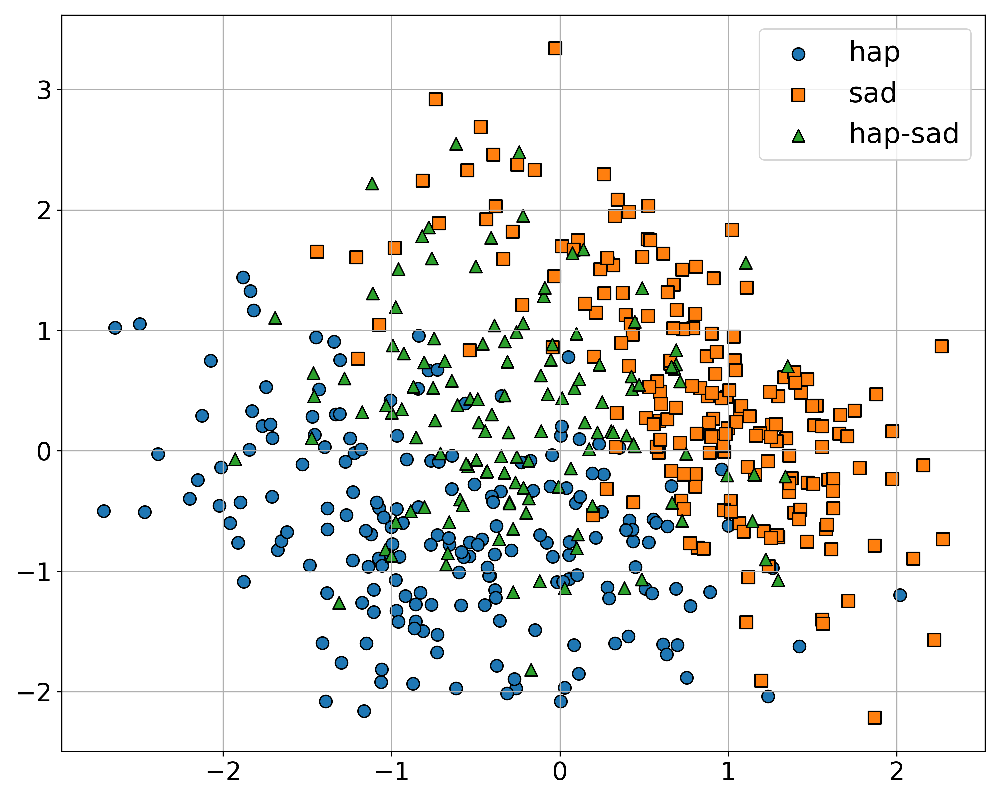
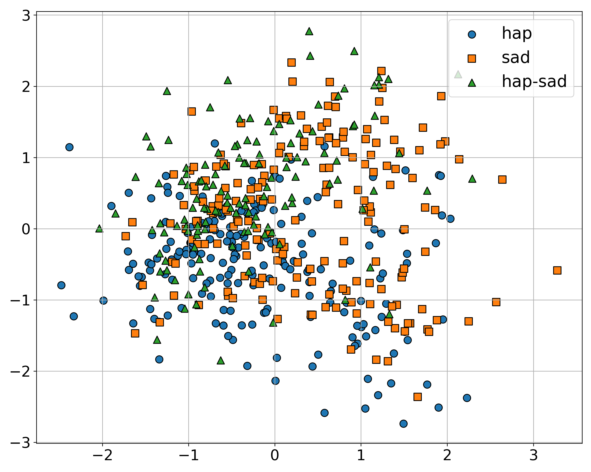
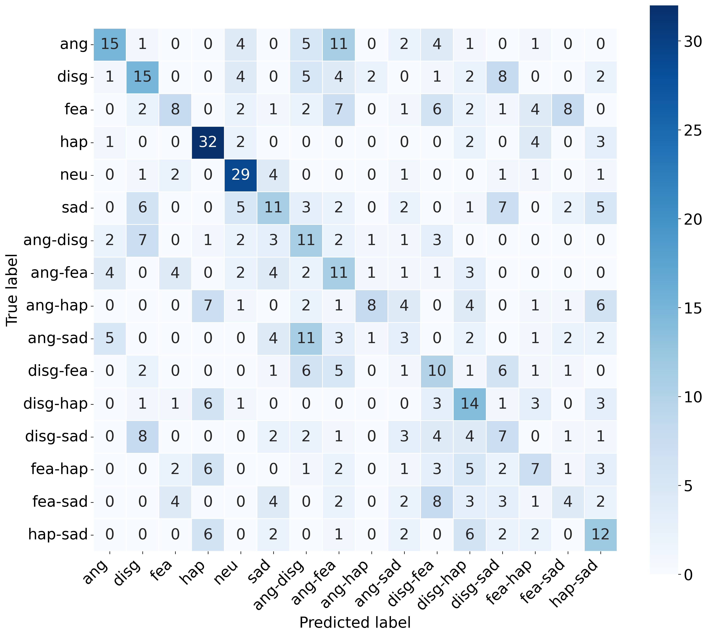

# BlEmoRe-common

This repository contains the codebase, baseline models, and evaluation tools for the **Blended Emotion Recognition Challenge (BlEmoRe)**.  
BlEmoRe introduces a novel publicly available dataset for **multimodal (video + audio) recognition of blended emotions**, featuring fine-grained **salience annotations** and standardized evaluation protocols.

The draft publication is available in [`paper.pdf`](paper.pdf).  
The dataset is available on [Zenodo](https://zenodo.org/records/15668840).

## What’s New in BlEmoRe?

- A multimodal dataset of 3,050 video clips from 58 actors (video + audio)
- Includes both single and blended emotions with controlled salience (e.g., 70/30 blend)
- Evaluation metrics for emotion presence and salience prediction
- Baselines across visual, audio, and fused modalities
- Public train/test split and 5-fold validation partitions

## Submission Guidelines

To participate in the challenge, download the test dataset from [Zenodo](https://zenodo.org/records/15668840) 
and email your predictions in accordance with the [submission template](./data/submission_template.json)
to the challenge organizer: [Petri Laukka](mailto:petri.laukka@psyk.uu.se). We will evaluate them on our server
and return the results to you.

Papers should be submitted via EasyChair: [Submit via EasyChair](https://easychair.org/conferences?conf=blemoreworkshopacii2).

Deadline for paper submission is **June 30, 2025**.

## Baseline Models

We provide baselines trained on features from the following pre-trained encoders:

### Video-based Encoders

- Frame-level: OpenFace 2.0, CLIP, ImageBind
- Spatiotemporal: VideoMAEv2, Video Swin Transformer

### Audio-based Encoders

- HuBERT (LL-60k), WavLM (Large)

### Multimodal Fusion

- Early fusion via concatenation (e.g., ImageBind + WavLM, VideoMAEv2 + HuBERT)

### Models

- Linear, MLP-256, MLP-512 architectures trained on:
  - Aggregated features (mean, std, percentiles)
  - Or short video clip subsamples (e.g., 16 frames for VideoMAEv2)

### Feature Visualizations

<div align="center">
  <table>
    <tr>
      <td>
        
        <p><b>Figure 2:</b> PCA projection of VideoMae features (Happy vs Sad).</p>
      </td>
      <td>
        
        <p><b>Figure 3:</b> PCA projection of WavLM features (Happy vs Sad).</p>
      </td>
    </tr>
  </table>
</div>

## Results Overview

### Validation (5-fold cross-validation, Aggregation, MLP-512)

| Encoder(s)              | Presence Accuracy        | Salience Accuracy        |
|-------------------------|--------------------------|--------------------------|
| ImageBind               | 0.290 ± 0.028            | 0.130 ± 0.008            |
| WavLM                   | 0.265 ± 0.027            | 0.121 ± 0.012            |
| VideoMAEv2 (subsampled) | 0.260 ± 0.030            | 0.124 ± 0.027            |
| **ImageBind + WavLM**   | **0.345 ± 0.035**        | **0.170 ± 0.055**        |

*Trivial baselines:*  
<sup>The single emotion baseline always predicts the most frequent single emotion;  
the blend baseline always predicts the most frequent emotion pair with a fixed salience ratio.  
They serve as reference points and yield the following accuracies on the full validation set:  
**Single emotion:** Presence = 0.078, Salience = 0.000  
**Blend:** Presence = 0.057, Salience = 0.035</sup>


### Test Set (Aggregation, MLP-512)

| Encoder(s)               | Presence Accuracy | Salience Accuracy |
|--------------------------|-------------------|-------------------|
| WavLM                    | 0.311             | 0.084             |
| VideoMAEv2               | 0.293             | 0.054             |
| **VideoMAEv2 + HuBERT**  | **0.332**         | **0.114**         |
| ImageBind + WavLM        | 0.327             | 0.114             |

*Trivial baselines:*  
<sup>Same strategy as above for test set.  
**Single emotion:** Presence = 0.074, Salience = 0.000  
**Blend:** Presence = 0.059, Salience = 0.036</sup>


<div align="left">
  
  <p><b>Figure 1:</b> Confusion matrix for VideoMAEv2+Hubert (Aggregation) model on the test set.</p>
</div>

## Running the baselines
To reproduce the baselines:

### 1. Download dataset

Download the dataset from [Zenodo](https://zenodo.org/records/15668840) and extract it.

### 2. Extract Features

Extract features using the provided scripts in `feature_extraction`.

### 4. Aggregate features:

Aggregate features using:

```sh
python feature_extraction/video_encoding/timeseries2aggregate.py
```

### 3. Train and evaluate models

Train and evaluate models:

For aggregation-based features:

```sh
python main.py
```

For subsampled features:

```sh
python main_subsampling.py
```

> **Note**: Make sure to update dataset and feature paths in the corresponding scripts before running.


## Tools

### Filename parser

A utility to parse filenames and extract metadata from the filenames is available in: `utils/filename_parser.py`.

### Accuracy metrics

Generic functions to calculate the accuracy metrics are available in: `utils/generic_accuracy/accuracy_funcs.py`.
These functions rely on predictions provided in the following dictionary format:

```python
{   
    # The key is the filename of the video
    'A411_mix_ang_hap_30_70_ver1':
        # The value is a list of dictionaries, 
        # each containing the predicted emotion and its salience
        [
            {'emotion': 'hap', 'salience': 70.0},
            {'emotion': 'ang', 'salience': 30.0}
        ],
    'A102_ang_int1_ver1':
        [
            {'emotion': 'neu', 'salience': 100.0}
        ]
    ...
}
```

We employ two main evaluation metrics: `ACC_presence` and `ACC_salience`.

- `ACC_presence` measures whether the correct label(s) are predicted without errors.
  A correct prediction must include all present emotions while avoiding false negatives
  (e.g., predicting only one emotion in a blend) and false positives
  (e.g., predicting emotions that are not part of the label).

- `ACC_salience` extends `ACC_presence` by considering the relative prominence of each emotion.
  It evaluates whether the predicted proportions reflect the correct ranking — whether the emotions
  are equally present or one is more dominant than the other. This metric applies only to blended emotions.

## Citation

If you use this code or the dataset in your research, please cite the draft version of our paper as a technical report:

```bibtex
@techreport{lachmann2025blemore,
  title     = {The BlEmoRe Workshop and Competition on Multimodal Blended Emotion Recognition},
  author    = {Lachmann, Tim and M{\"u}ller, Philipp and Saghinadze, Teimuraz and Balazia, Michal and Israelsson, Alexandra and Laukka, Petri},
  institution = {Stockholm University, German Research Center for AI, Georgian Technical University, INRIA, Uppsala University},
  year      = {2025},
  note      = {Technical Report},
  url       = {https://zenodo.org/records/15668840}
}
```
